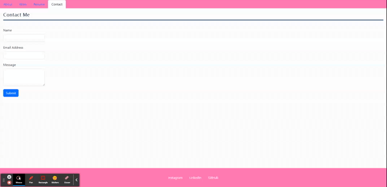

# Mias React Portfolio

## Description

This website will showcase my work for potential employers to review. It will highlight my strengths and give insight to the thought processes behind my projects.I utilized React and bootstrap to create this project. 

## Table of Contents 

- [Installation](#installation)
- [Usage](#usage)
- [Credits](#credits)
- [License](#license)

## Installation

You can access this project by clicking the following link: https://654bd83b40b0ee2f83cfaa22--clever-gaufre-fcafc0.netlify.app/

## Usage
The page can be navigated by using the links in the nav bar. 

Each project card is a clickable link that will lead to finished projects.

Use the form in the Contact me section to get in touch with me!

## Credits

[Coding Bootcamp](https://courses.bootcampspot.com)

[Professor Phil Loy](https://github.com/philliploy)

[Bootstrap Documentation](https://getbootstrap.com/docs/5.3/getting-started/introduction/)

[Pixabay for photos](https://pixabay.com/)

## License

This project is licensed under the [MIT License](LICENSE).

